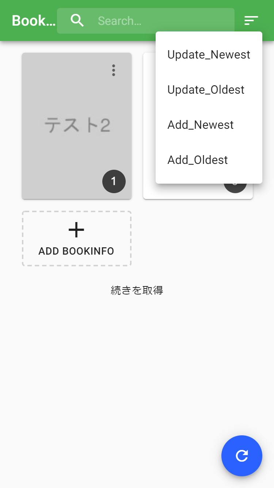

# Book Reader

[](https://hub.docker.com/r/syuchan1005/book_reader)



## how to use?

> when you use v1.0.5, please run command ↓
> `$ node scripts/removeCacheInBefore.js`


```shell script
$ echo '' > {FOLDER_PATH}/production.sqlite
$ docker run \
  --name book_reader \
  -p 80 \
  -v {FOLDER_PATH}/storage:/bookReader/storage \
  -v {FOLDER_PATH}/production.sqlite:/bookReader/production.sqlite \
  syuchan1005/book_reader
```

## develop use
```shell script
$ npm install
$ npm run serve
```
